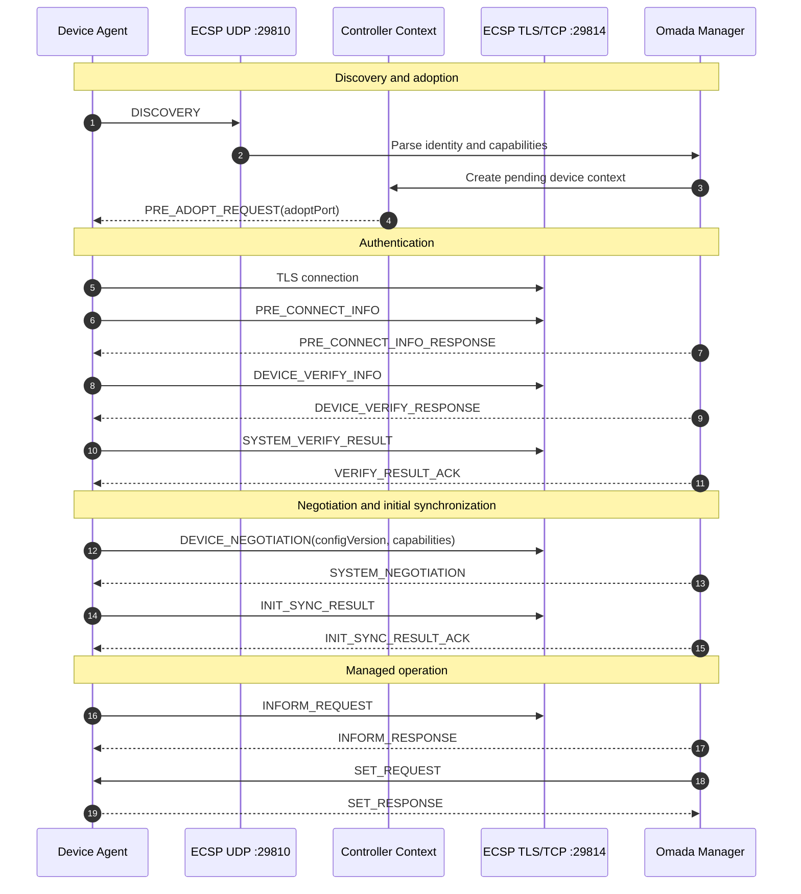
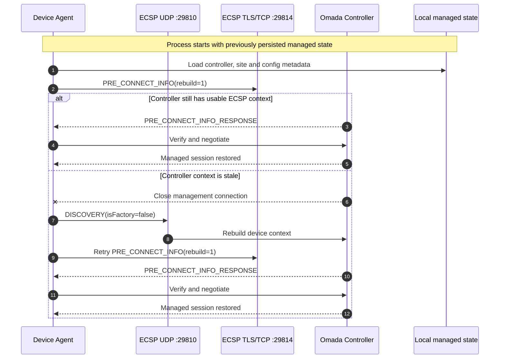

# Open Omada Device Agent

> Experimental, unofficial device-side implementation of the Omada ECSP protocol.

**Open Omada Device Agent** is an interoperability and protocol-research project
that implements enough of the device side of Omada ECSP to discover, adopt,
authenticate, synchronize, reconnect, and report a reference access point to an
Omada Network Application controller.

The project is maintained under the **Open Omada** organization and is intended
as a foundation for open device integrations, protocol documentation, test
fixtures, and future device adapters.

> [!WARNING]
> This project is **alpha software**. It is not affiliated with, endorsed by, or
> sponsored by TP-Link or Omada. Do not use it on production networks unless you
> understand the protocol and operational risks.

## Current status

The current reference implementation targets the ECSP V2 family observed with
Omada Network Application `6.2.14.11` and an EAP110 v4-compatible AP profile.

| Area | Status |
| --- | --- |
| UDP discovery / site-scoped discovery | ✅ Working |
| `PRE_ADOPT_REQUEST` handling | ✅ Working |
| TLS management channel | ✅ Working |
| Legacy V2 mutual Device Account verification | ✅ Working |
| Device/system negotiation | ✅ Working |
| Initial sync | ✅ Working |
| Managed state persistence | ✅ Working |
| Restart without another manual Adopt | ✅ Working |
| Managed rediscovery / stale-context recovery | ✅ Working |
| Periodic device informs | ✅ Working |
| `SET_REQUEST` acknowledgement | 🟡 Partial; rejects unsupported keys |
| Radio/SSID configuration | 🟡 Partial OpenWrt UCI adapter |
| SSID VLAN configuration | 🟡 Opt-in OpenWrt UCI adapter |
| DHCP lease client reporting | 🟡 Partial |
| OpenWrt radio/SSID telemetry | 🟡 Partial via `ubus` |
| LED enable/disable | 🟡 Optional sysfs adapter |
| FORGET / forget-no-reset response | ✅ Working |
| Captive portal sessions/enforcement | 🟡 Library support; not wired to SSID provisioning |
| Portal RADIUS authentication | 🟡 Library support; not wired to HTTP portal flow |
| `GET_REQUEST` | 🚧 Not implemented |
| Notify/report families | 🚧 Not implemented |
| Switch/gateway/OLT device profiles | 🚧 Planned |

The capability table is intentionally conservative. The agent advertises only
components whose lifecycle is currently understood well enough not to mislead
the controller.

## Protocol at a glance

The most useful way to read ECSP is as a sequence of exchanges between the
device and the controller. The diagram below shows the currently implemented V2
path from first discovery to managed operation.



Static software relationships are documented separately with architecture
diagrams. See [docs/architecture.md](docs/architecture.md),
[docs/protocol-overview.md](docs/protocol-overview.md), and
[docs/device-lifecycle.md](docs/device-lifecycle.md) for the complete model.

## Quick start

### 1. Create a virtual environment

```bash
python3 -m venv .venv
source .venv/bin/activate
python -m pip install --upgrade pip
python -m pip install -e .
```

For development:

```bash
python -m pip install -e '.[dev]'
```

### 2. Configure the controller

```bash
cp .env.example .env
```

Edit `.env` and set at least:

```dotenv
OMADA_CONTROLLER_HOST=omada-controller.example.net
OMADA_CONTROLLER_ID=0123456789abcdef0123456789abcdef
OMADA_SITE_ID=0123456789abcdef01234567
OMADA_DEVICE_PASSWORD=your-device-account-password
```

The Device Account password is read only from the environment and is **never
written to the managed-state file**.

### 3. Run the agent

```bash
open-omada-agent --dump-tx
```

Equivalent development entry point:

```bash
python -m open_omada_device_agent --dump-tx
```

The legacy launcher is retained for migration:

```bash
python agent.py --dump-tx
```

## Runtime behavior

A first-time device follows the discovery and adoption path. After successful
initial synchronization, the agent persists only non-secret routing and config
metadata. A later process restart attempts a managed reconnect directly.

If the controller has expired transient ECSP state, repeated direct reconnects
are stopped and the agent performs **managed rediscovery** with
`isFactory=false`, allowing the controller to rebuild the device-side context
without requiring another manual Adopt action in the normal recovery case.



## Documentation

- [Protocol overview](docs/protocol-overview.md)
- [ECSP wire format](docs/ecsp-wire-format.md)
- [Device lifecycle](docs/device-lifecycle.md)
- [Project architecture](docs/architecture.md)
- [Configuration reference](docs/configuration.md)
- [Protocol support matrix](docs/protocol-status.md)
- [Research methodology](docs/research-methodology.md)
- [Development guide](docs/development.md)
- [Security model](SECURITY.md)

## Project layout

```text
.
├── src/open_omada_device_agent/
│   ├── adoption.py          # TLS, verification, negotiation, managed channel
│   ├── ap_config.py         # AP SET_REQUEST domain parser
│   ├── capabilities.py      # conservative component advertisement
│   ├── client_tracking.py   # DHCP lease to client inform mapping
│   ├── config.py            # OMADA_* environment configuration
│   ├── crypto.py            # legacy V2 authentication primitives
│   ├── device_commands.py   # local LED/device command adapters
│   ├── discovery.py         # UDP discovery and reconnect supervision
│   ├── domain.py            # AP config/client/portal domain models
│   ├── ecsp.py              # message types and length-prefixed JSON codec
│   ├── identity.py          # reference AP identity and telemetry
│   ├── openwrt.py           # OpenWrt UCI reconciliation
│   ├── portal.py            # captive portal session lifecycle
│   ├── portal_enforcement.py# nftables captive portal policy adapter
│   ├── radius.py            # minimal RADIUS PAP client
│   ├── session_state.py     # non-secret managed state persistence
│   ├── telemetry.py         # OpenWrt wireless inform telemetry
│   └── cli.py               # command-line entry point
├── docs/
├── tests/
└── pyproject.toml
```

## Research and provenance

The implementation is based on protocol behavior observed through controlled
lab testing, packet captures, controller logs, and interoperability research.
Documentation distinguishes confirmed wire behavior from assumptions and
incomplete areas where possible.

This repository does **not** include vendor firmware, vendor source code,
decompiled vendor code, certificates, private keys, or proprietary assets.

## Security and responsible use

Use a dedicated lab controller and test network whenever possible. Never commit
`.env`, controller tokens, Device Account passwords, packet captures containing
credentials, or managed-state files from sensitive environments.

See [SECURITY.md](SECURITY.md) before reporting a vulnerability or publishing a
capture that may contain secrets.

## Contributing

Protocol captures, controller-version compatibility reports, tests, and clean
room implementations of additional message families are welcome. Read
[CONTRIBUTING.md](CONTRIBUTING.md) before opening a pull request.

## License

Apache License 2.0. See [LICENSE](LICENSE) and [NOTICE](NOTICE).
