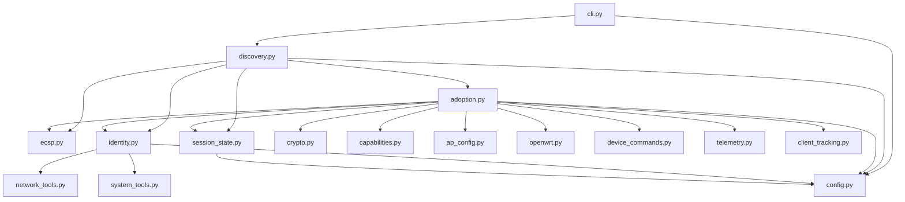
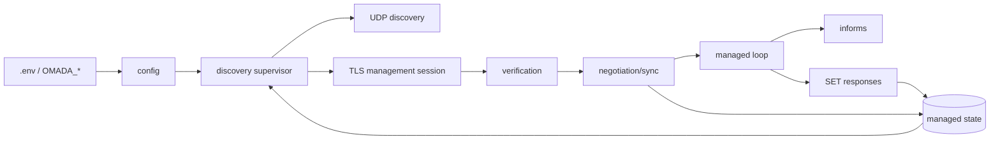
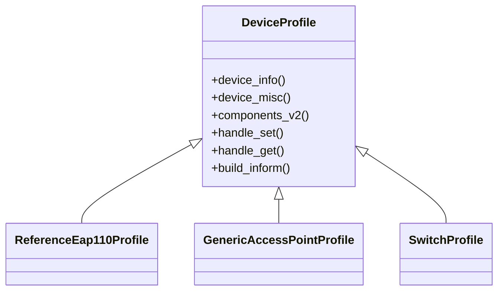

# Project Architecture

## Goals

The architecture is intentionally split into protocol primitives, lifecycle
orchestration, device identity, and persistence. The long-term goal is to make
ECSP reusable for device profiles beyond the current reference AP.

## Module graph

## Responsibilities

### `ecsp.py`

Protocol-level primitives only:

- message type identifiers;
- MAC normalization;
- message envelope construction;
- 4-byte big-endian framing;
- TCP frame read/write helpers.

It deliberately does not know about adoption or controller state.

### `discovery.py`

Owns the long-running supervisor:

- first discovery;
- site-scoped routing;
- PRE_ADOPT processing;
- credential-rejection recovery;
- direct managed reconnect;
- managed rediscovery after stale controller context.

### `adoption.py`

Owns the management TLS session and ECSP V2 state machine:

- PRE_CONNECT;
- mutual verification;
- negotiation;
- initial synchronization;
- managed informs;
- supported configuration acknowledgements.

### `identity.py`

Builds the reference device profile used by discovery, negotiation, and informs.
The current profile models a wired EAP110 v4-compatible AP and is expected to be
replaced by a more formal device-profile abstraction as additional models are
implemented.

### `capabilities.py`

Contains the deliberately small ECSP component advertisement. This file is the
contract between what the device claims to support and what the managed loop is
actually prepared to handle.

### `session_state.py`

Persists only non-secret state required for reconnect and configuration
continuity. It is intentionally separate from credentials.

### `crypto.py`

Contains the validated legacy ECSP V2 authentication calculations. It should
remain protocol-focused and side-effect free.

### AP management modules

- `ap_config.py` parses AP `SET_REQUEST` bodies into domain models without
  applying them.
- `openwrt.py` reconciles supported radio/SSID/VLAN domains through UCI.
- `device_commands.py` handles local command-like keys such as configured
  sysfs LED brightness writes.
- `client_tracking.py` maps observed dnsmasq leases to Omada `clients` inform
  entries.
- `telemetry.py` maps OpenWrt `ubus network.wireless status` to conservative
  `wSettings_*` and `ssidStats_*` inform keys.
- `portal.py`, `portal_enforcement.py`, and `radius.py` provide captive portal
  session, nftables, and RADIUS primitives. Portal SSID provisioning remains
  deliberately rejected until these pieces are wired end to end.

## Runtime data flow

## Design constraints

### Conservative capability advertisement

An empty capability map can be syntactically accepted but semantically invalid
to the controller. Conversely, advertising every component returned by the
controller would imply support the agent does not yet have. The current design
therefore advertises the smallest validated useful set.

### Persistent state is not authentication state

The reconnect file is not a credential cache. Authentication occurs again on a
new TLS session using the Device Account password supplied through the runtime
environment.

### Protocol observations should be isolated

New message families should be added in layers:

1. enum/wire identity;
2. body schema or typed model;
3. parser/validator;
4. handler;
5. tests;
6. capability advertisement, only after the behavior is implemented.

## Future refactor direction

As device coverage grows, the reference identity functions can evolve into a
profile interface:

That allows the ECSP transport/lifecycle code to remain independent from the
specific device being represented.
