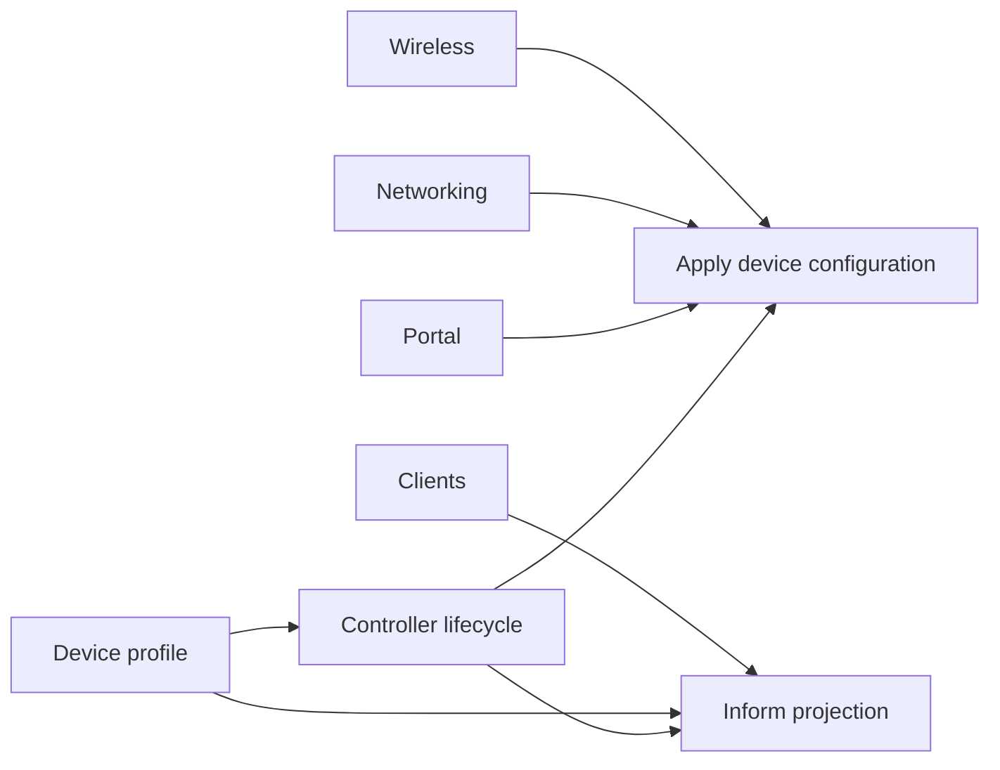
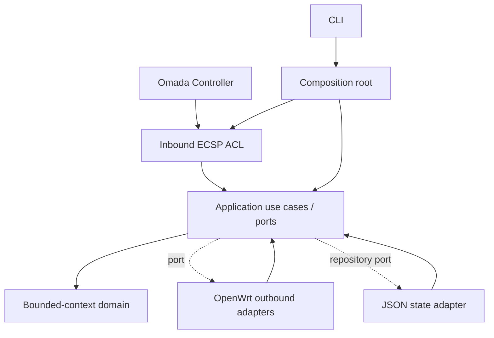
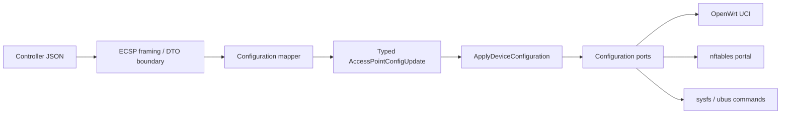
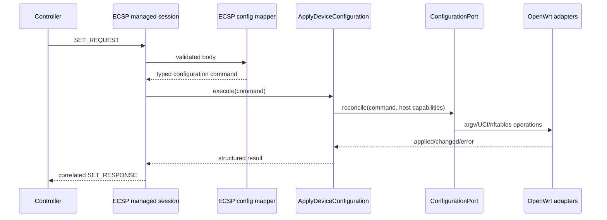
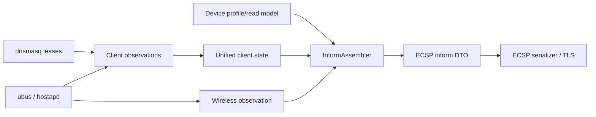

# Architecture

The agent uses bounded contexts with ports and adapters. This is an incremental
migration: stable top-level modules remain compatibility façades, while new
code imports context APIs or adapter packages directly.

## Bounded contexts

| Context | Responsibility | Public API |
|---|---|---|
| Device | identity, profile contract, advertised capabilities | `contexts.device.domain` |
| Lifecycle | explicit controller-session states and reconnect persistence model | `contexts.lifecycle` |
| Wireless | radio, SSID, security and SSID network intent | `contexts.wireless` |
| Networking | management/SSID VLAN and DHCP Option 82 intent | `contexts.networking` |
| Clients | unified state merged from DHCP and hostapd observations | `contexts.clients` |
| Portal | captive policy and authentication state | `contexts.portal` |

Telemetry is a projection, not a bounded context: collectors produce
observations and `projections.inform.InformAssembler` creates the controller
read model.

## Dependency direction

Domain modules use the standard library and the minimal shared kernel only.
Application modules define needs as structural `Protocol` ports. Concrete UCI,
nftables, sysfs, ubus, dnsmasq and JSON-file code is selected only by
`bootstrap.runtime`.

The CLI snapshots environment variables into an immutable `AgentSettings` and
passes it to `build_runtime(settings)`. Lifecycle, profiles, repositories, and
configured OpenWrt adapters receive that snapshot explicitly; they do not read
the global environment configuration during orchestration.

## Controller-to-platform path

`adapters.inbound.ecsp` is an anti-corruption layer. Raw mappings are accepted
only at framing and mapper boundaries. The mapper emits typed radio, WLAN,
networking, portal and client intents. Unknown raw properties are retained only
for compatibility/debugging and never drive shell interpolation.

## Managed configuration flow

The protocol session no longer constructs concrete UCI, portal, LED or client
control adapters. `ApplyDeviceConfiguration` selects the required ports and
stops on the first failed reconciliation, preserving the existing ECSP error
mapping at the boundary.

## Telemetry and inform flow

Collection, merged state, and projection are separate. A future Linux or
firmware adapter can replace collectors in the composition root without
changing the inform assembler or managed-session protocol.

## Ports and adapters

Current application ports are `ConfigurationPort`, `CapabilityDetector`,
`InformProvider`, and `SessionStateRepository`. Configuration ports are consumed
by the cross-context `ApplyDeviceConfiguration` orchestrator; implementations are
`OpenWrtUciAdapter`, `OpenWrtPortalRuntime`, `SysfsLedAdapter`, and
`OpenWrtClientControlAdapter`. `InformAssembler` receives callable observation
ports. Managed state is represented in lifecycle domain and persisted by the injected
`JsonSessionStateRepository` adapter under `contexts.lifecycle.infrastructure`.

## Extension points

### Add a platform

Implement the application ports using platform-native APIs, add observation
collectors, then select them in `bootstrap.runtime`. Do not change ECSP framing,
configuration mapping, or domain models for platform command syntax.

### Add a device profile

Implement `DeviceProfile` and provide identity, static information and a
conservative components map. Inject it at composition. Lifecycle and ECSP must
not branch on a model name. The current runtime uses
`GenericOpenWrtAccessPointProfile`; replacing it does not require changing
discovery or adoption.

### Add an ECSP family

Add its wire identifier/DTO under `adapters.inbound.ecsp`, map it to a typed
application command, add a handler invoking a use case, and advertise the
component only after its behavior is implemented.

## Compatibility façades

`domain.py`, `ecsp.py`, `crypto.py`, `ap_config.py`, `openwrt.py`, and
`session_state.py` re-export relocated APIs. They preserve external imports and
existing characterization tests during migration. New internal code must not
use these façades. Concrete OpenWrt UCI, capability detection, telemetry, client
observations, device commands, and portal enforcement live under
`adapters.outbound.openwrt`; the façades contain no duplicate implementation.

## Incremental projection debt

OpenWrt wireless telemetry still translates some host observations directly to
legacy Omada inform keys, and client payload serialization remains colocated
with the client observation adapter. A later behavior-preserving migration
should introduce typed wireless observations and move those two serializers
fully into `projections.inform`. This is an explicit migration seam, not a
contract for new platform adapters.
