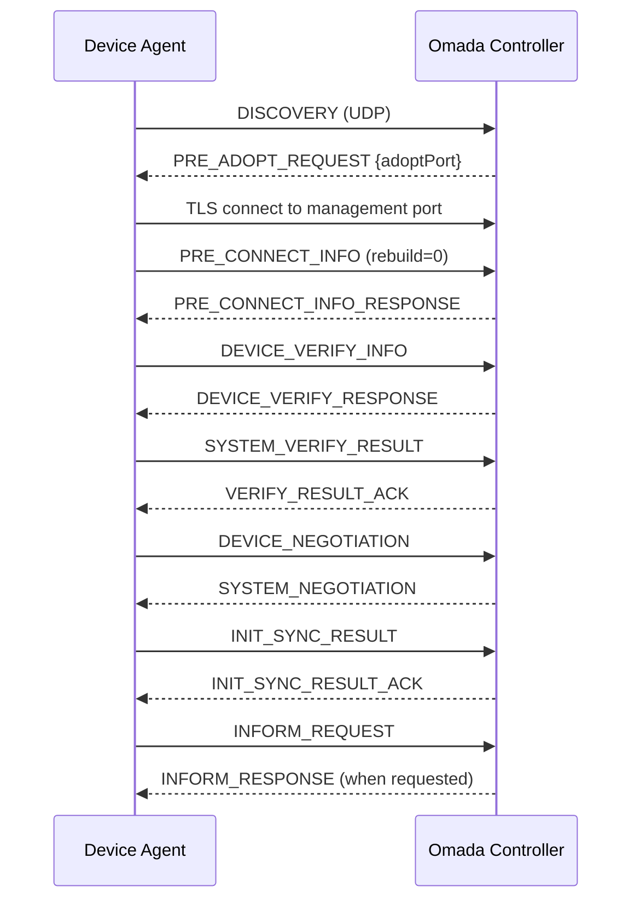
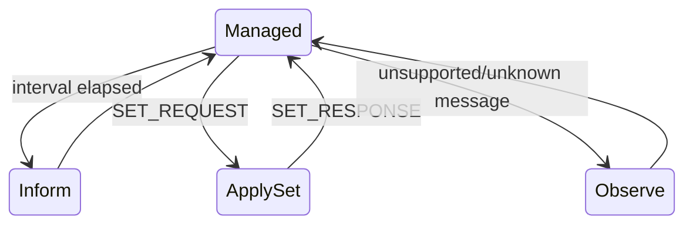
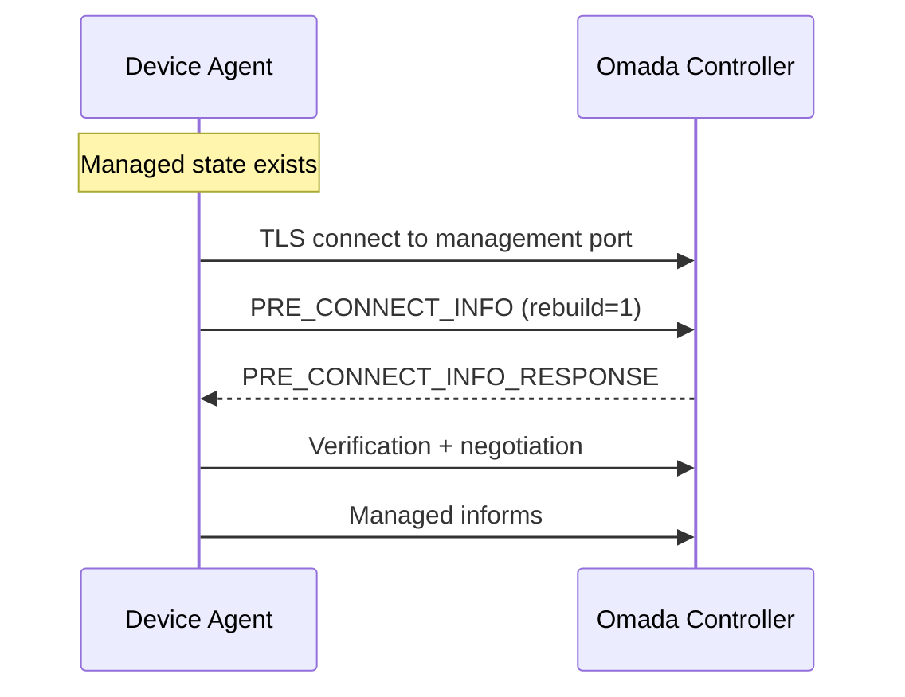
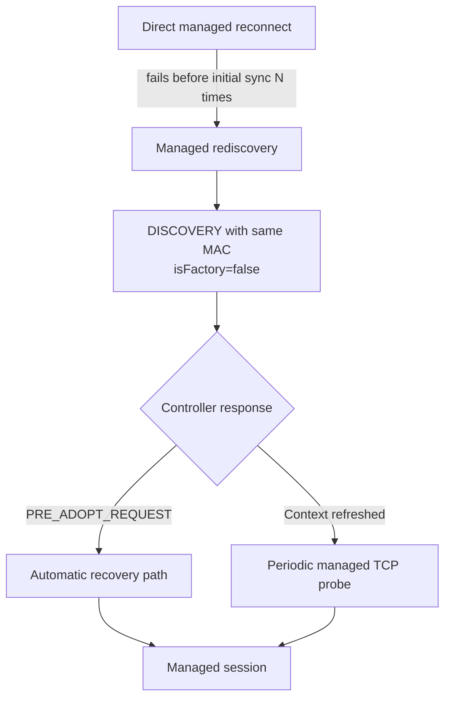

# Device Lifecycle

This document describes the lifecycle implemented by the reference AP agent.

## First adoption

### Discovery

The device sends `DISCOVERY` over UDP. For site-scoped operation,
`header.dest` is set to the Site ID while `controllerSetting.controllerId`
retains the logical Controller ID.

### Pre-adoption

The controller returns `PRE_ADOPT_REQUEST` with the TCP management/adoption
port. The agent uses the supplied port when present rather than assuming a
hard-coded value.

### Pre-connect

The first-adoption request uses `rebuild=0`. The managed reconnect path uses
`rebuild=1`.

### Mutual verification

The agent requests the Device Account username when needed and uses the locally
configured password to complete the supported legacy verification branch.
Credential rejection is recoverable and does not terminate the supervisor.

### Negotiation and sync

`DEVICE_NEGOTIATION` advertises the reference profile and a conservative
component map. `SYSTEM_NEGOTIATION` returns controller-side configuration,
versioning, timing, and component information. The agent acknowledges the
initial synchronization with `INIT_SYNC_RESULT`.

## Managed operation

After `INIT_SYNC_RESULT_ACK`, the current managed loop:

- persists non-secret reconnect/config metadata;
- sends periodic `INFORM_REQUEST` messages;
- acknowledges supported `SET_REQUEST` envelopes;
- logs unsupported command families for further protocol research.

## Configuration versions

Two configuration versioning forms have been validated:

1. absolute `configVersion`;
2. incremental `configVersionInc`.

For an incremental request, the agent derives the resulting absolute version
from the version it has already applied and persists the new value.

## Restart and reconnect

A successful managed session writes a local state file containing only:

- device MAC;
- controller host and logical identifier;
- management port;
- site identifier;
- Device Account username;
- last configuration version;
- last configuration sequence identifier;
- state schema version and update timestamp.

The Device Account password is not stored.

### Direct reconnect

### Managed rediscovery

A controller can retain the visible device record while expiring transient ECSP
context. In that case direct pre-connect attempts may be rejected before the
controller sends a response.

The supervisor therefore stops aggressive reconnect attempts and falls back to
managed rediscovery:

This design avoids treating an already-known device as factory-new while still
allowing controller-side protocol context to be rebuilt.
