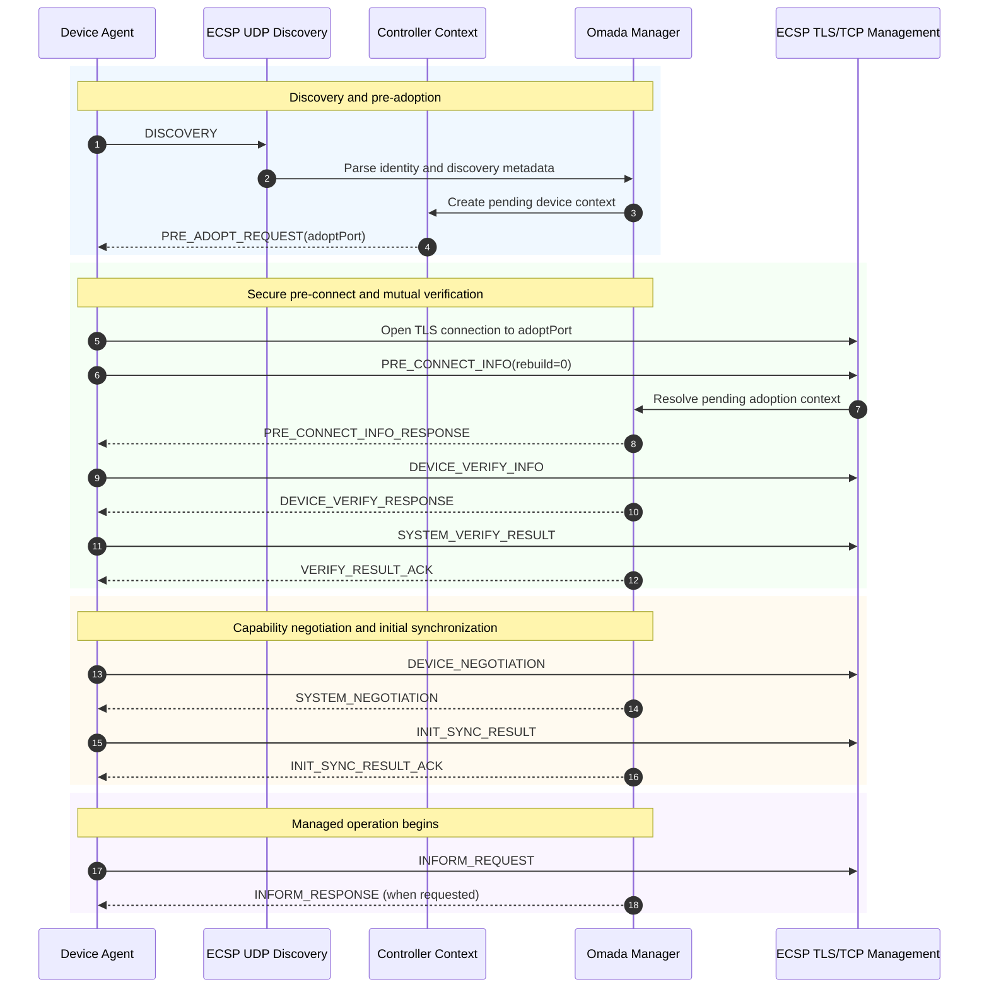
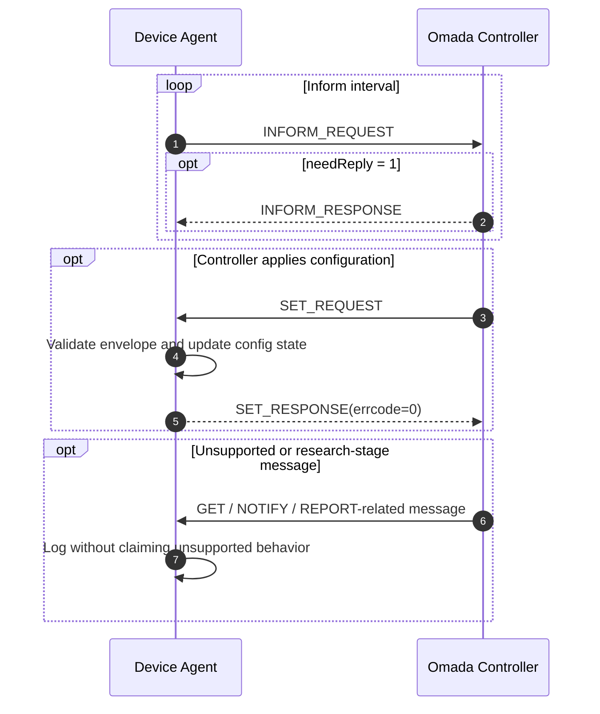
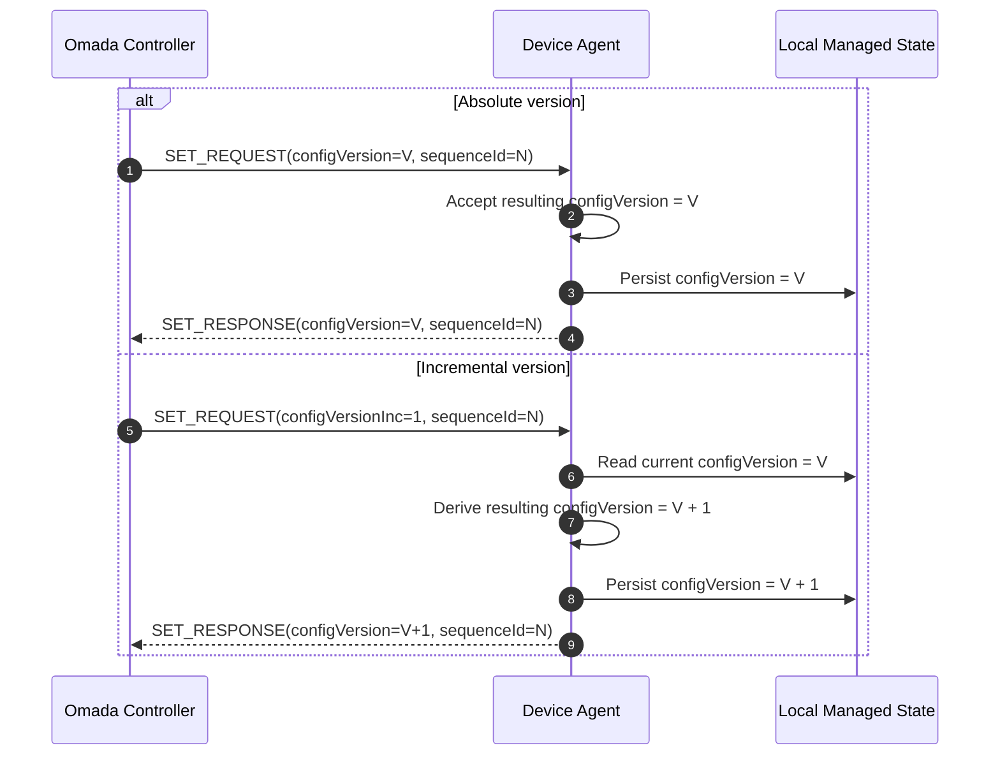
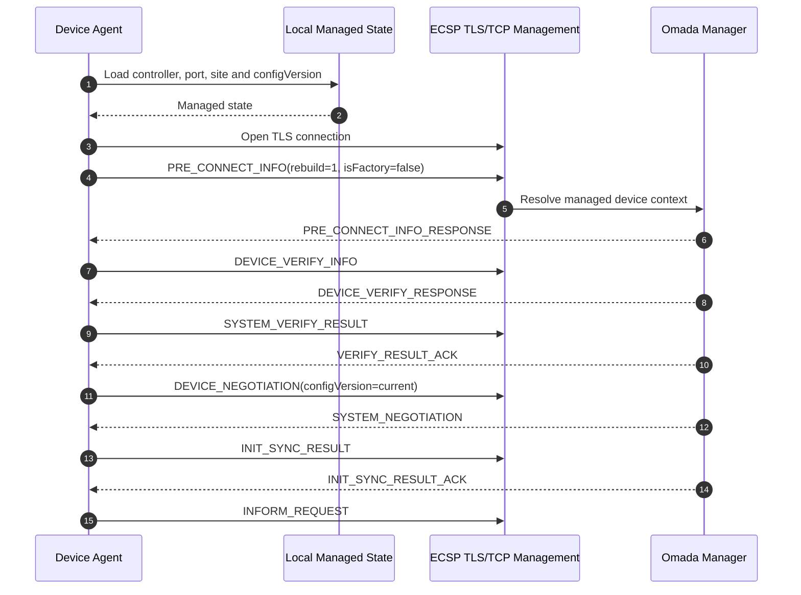
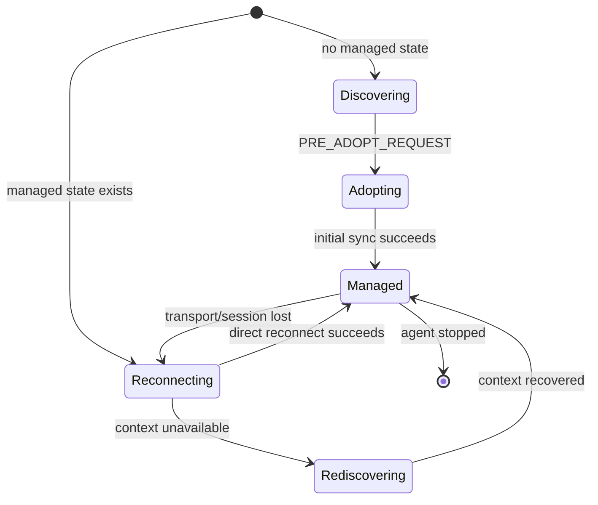

# Device Lifecycle

This document describes the lifecycle implemented by the reference AP agent.
Protocol exchanges are shown primarily as Mermaid sequence diagrams so that
message direction, transport, ordering, and controller state transitions remain
visible at a glance.

## Diagram conventions

The documentation uses a small set of diagram types consistently:

- `sequenceDiagram` for ECSP exchanges and device lifecycle flows;
- `stateDiagram-v2` for local state transitions;
- `flowchart` for software architecture and static relationships.

Unless a diagram says otherwise, `UDP` refers to ECSP discovery traffic and
`TLS/TCP` refers to the ECSP management channel.

## First adoption



### Discovery

The device sends `DISCOVERY` over UDP. For site-scoped operation,
`header.dest` is set to the Site ID while `controllerSetting.controllerId`
retains the logical Controller ID.

### Pre-adoption

The controller returns `PRE_ADOPT_REQUEST` with the TCP management/adoption
port. The agent uses the supplied port when present rather than assuming a
hard-coded value.

### Pre-connect

The first-adoption request uses `rebuild=0`. The managed reconnect path uses
`rebuild=1`.

### Mutual verification

The agent requests the Device Account username when needed and uses the locally
configured password to complete the supported legacy verification branch.
Credential rejection is recoverable and does not terminate the supervisor.

### Negotiation and sync

`DEVICE_NEGOTIATION` advertises the reference profile and a conservative
component map. `SYSTEM_NEGOTIATION` returns controller-side configuration,
versioning, timing, and component information. The agent acknowledges the
initial synchronization with `INIT_SYNC_RESULT`.

## Managed operation

After `INIT_SYNC_RESULT_ACK`, the device enters its long-lived managed session.
The current implementation sends periodic informs and acknowledges the subset
of configuration requests it understands.



The managed loop also persists non-secret reconnect and configuration metadata
so that restarts do not require a fresh manual adoption.

## Configuration versions

Two configuration versioning forms have been validated: absolute
`configVersion` and incremental `configVersionInc`.



## Restart and reconnect

A successful managed session writes a local state file containing only:

- device MAC;
- controller host and logical identifier;
- management port;
- site identifier;
- Device Account username;
- last configuration version;
- last configuration sequence identifier;
- state schema version and update timestamp.

The Device Account password is not stored.

### Direct managed reconnect

When persisted state is available, the agent first attempts to resume the
management session directly without emitting a factory-style discovery.



### Managed rediscovery

A controller can retain the visible device record while expiring transient ECSP
context. In that case direct pre-connect attempts can be rejected before
`PRE_CONNECT_INFO_RESPONSE` is emitted.

The supervisor therefore limits direct reconnect attempts and falls back to a
managed rediscovery using the same MAC with `isFactory=false`.

```mermaid
sequenceDiagram
    autonumber

    participant D as Device Agent
    participant STATE as Local Managed State
    participant UDP as ECSP UDP Discovery
    participant CTX as Controller Context
    participant TCP as ECSP TLS/TCP Management
    participant MGR as Omada Manager

    D->>STATE: Load managed state

    loop Limited direct reconnect attempts
        D->>TCP: PRE_CONNECT_INFO(rebuild=1)
        TCP->>MGR: Resolve managed context
        MGR--xD: Close before PRE_CONNECT_INFO_RESPONSE
    end

    Note over D,MGR: Direct reconnect exhausted; switch to managed rediscovery
    D->>UDP: DISCOVERY(same MAC, isFactory=false, site-scoped dest)
    UDP->>MGR: Refresh known-device discovery image
    MGR->>CTX: Rebuild or refresh transient ECSP context

    alt Controller emits PRE_ADOPT_REQUEST
        CTX-->>D: PRE_ADOPT_REQUEST(adoptPort)
        D->>TCP: Open recovery management session
        D->>TCP: PRE_CONNECT_INFO
        TCP->>MGR: Continue recovery handshake
        MGR-->>D: PRE_CONNECT_INFO_RESPONSE
    else Context becomes available without PRE_ADOPT
        D->>TCP: Periodic managed reconnect probe
        TCP->>MGR: Resolve refreshed context
        MGR-->>D: PRE_CONNECT_INFO_RESPONSE
    end

    D->>MGR: Verification, negotiation and initial sync
    MGR-->>D: Managed session restored
```

This recovery path preserves the already-managed identity and avoids requiring
a user to click **Adopt** again after a normal process restart.

## Lifecycle summary


