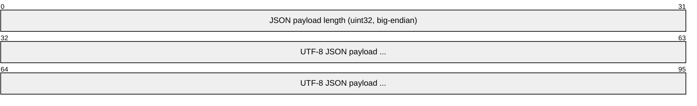

# ECSP Wire Format

## Frame layout

The ECSP framing implemented by this project is a 4-byte unsigned big-endian
payload length followed by UTF-8 JSON.



Equivalent pseudocode:

```text
payload = utf8(json(message))
frame   = uint32_be(len(payload)) || payload
```

The four-byte length field is **not included** in the declared JSON payload
length.

## UDP discovery

Discovery datagrams contain one complete ECSP frame. The current implementation
limits the discovery JSON payload to 2000 bytes because that matches the
validated controller-side boundary for this protocol path.

```text
UDP datagram
┌──────────────┬───────────────────────────────┐
│ 4-byte len   │ JSON payload                  │
└──────────────┴───────────────────────────────┘
```

## TCP management channel

The same length-prefixed frames are carried inside the established management
TLS stream.


TLS termination happens before the ECSP frame decoder. The ECSP codec therefore
operates on the plaintext length prefix and JSON payload.

## Decoder rules

The current codec rejects:

- frames shorter than the four-byte prefix;
- declared lengths that do not match the actual payload;
- invalid UTF-8/JSON;
- JSON roots that are not objects;
- TCP payload lengths outside the configured safety boundary.

## Correlation

Some response families mirror the request `header.seq`, while configuration
messages also carry a body-level `sequenceId`. These fields are distinct and
should not be conflated.

For example, a `SET_RESPONSE` currently uses:

```json
{
  "header": {
    "seq": 77,
    "type": 8192
  },
  "body": {
    "sequenceId": 14,
    "errcode": 0,
    "configVersion": 3
  }
}
```

The header sequence correlates the transport-level exchange; the body sequence
participates in the controller's configuration synchronization model.
