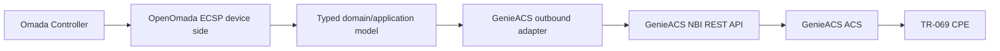

# GenieACS Backend

GenieACS support is a remote-device backend for CPEs that already speak
TR-069/CWMP to GenieACS. OpenOmada does not implement CWMP, SOAP, a connection
request server, or direct GenieACS MongoDB access.



## Current phase

Phase 1 implements only the foundation:

- immutable settings for the GenieACS backend;
- a small standard-library NBI HTTP client;
- safe device-id URL encoding and query parameter encoding;
- bounded response body reads;
- optional bearer token or Basic Auth;
- header redaction helpers so Authorization values are not logged;
- explicit task states for `200` executed, `202` queued, and faulted tasks;
- normalized TR-069 parameter trees from GenieACS device documents.

The backend is not yet selected by `build_runtime()`. OpenWrt remains the only
runtime-wired platform backend in this phase.

## Configuration

Use `OPENOMADA_PLATFORM=genieacs` for the intended backend selector. Existing
`OMADA_PLATFORM` remains accepted for backward compatibility.

```dotenv
OPENOMADA_PLATFORM=genieacs
GENIEACS_URL=https://acs.example.net:7557
GENIEACS_DEVICE_ID=001122-Example-ABC123
GENIEACS_TIMEOUT_SECONDS=10
GENIEACS_APPLY_TIMEOUT_SECONDS=15
GENIEACS_VERIFY_TLS=true
GENIEACS_CA_BUNDLE=/etc/ssl/certs/genieacs-ca.pem
GENIEACS_TOKEN=
GENIEACS_USERNAME=
GENIEACS_PASSWORD=
```

The model is intentionally one CPE per OpenOmada process. The canonical CPE
reference is the exact GenieACS `_id`; multi-device orchestration is a later
supervisor concern.

## NBI operations

The Phase 1 client models:

| Operation | NBI request |
| --- | --- |
| Query devices | `GET /devices?query=...&projection=...` |
| Query one device | `GET /devices?query={"_id":"..."}` |
| Submit task | `POST /devices/<device_id>/tasks` |
| Submit connection-request task | `POST /devices/<device_id>/tasks?connection_request` |
| List tasks | `GET /tasks?query=...` |
| Delete task | `DELETE /tasks/<task_id>` |

Convenience task builders exist for `refreshObject`, `getParameterValues`,
`setParameterValues`, `addObject`, and `deleteObject`.

## Task semantics

GenieACS task acceptance is not equivalent to device-side application.

| HTTP status | Adapter state | Meaning |
| --- | --- | --- |
| `200` | `EXECUTED` | GenieACS reports immediate task execution |
| `202` | `QUEUED` | GenieACS queued the task for a future CPE inform/session |
| `200` with faults | `FAILED` | HTTP succeeded, but GenieACS reports task faults |

Future configuration reconciliation must treat `QUEUED` as not applied. Omada
`SET_RESPONSE` success must only be sent after the desired CPE state is verified.

## Parameter normalization

GenieACS device documents expose TR-069 parameters as nested objects with keys
such as `_value`, `_type`, `_writable`, and `_timestamp`. The adapter converts
those documents into `ParameterTree` and `GenieAcsParameter` objects.

Supported helpers include:

- string, boolean, integer, unsigned-integer, date/time, and MAC coercion;
- missing-value defaults;
- immutable sorted parameter maps;
- prefix/root queries for later TR-181/TR-098 profile detection;
- freshness checks based on parameter timestamps.

Internal MAC normalization follows the project policy: `aa:bb:cc:dd:ee:ff`
inside OpenOmada, `AA-BB-CC-DD-EE-FF` only at Omada-facing boundaries.

## TR-181 and TR-098 status

Phase 1 does not map Wi-Fi objects yet. It only provides the parameter-tree
foundation needed by profiles.

Planned TR-181 areas:

- `Device.WiFi.Radio.{i}`;
- `Device.WiFi.SSID.{i}`;
- `Device.WiFi.AccessPoint.{i}`;
- `Device.WiFi.AccessPoint.{i}.Security`;
- `Device.WiFi.AccessPoint.{i}.AssociatedDevice.{i}`.

Planned TR-098 areas:

- `InternetGatewayDevice.LANDevice.{i}.WLANConfiguration.{i}`;
- related security and associated-device tables where present.

Profiles must build relationships from references and parameter existence, not
from fixed assumptions such as instance `.1` always meaning 2.4 GHz.

## Security constraints

- TLS verification for GenieACS is enabled by default.
- Device IDs and task IDs are URL encoded before use in paths.
- JSON responses are bounded and validated.
- Authorization headers are redacted.
- GenieACS password/token settings are excluded from `repr`.
- No GenieACS credentials are written to managed ECSP state.
- The adapter does not shell out and does not query MongoDB.

## Testing

The standard test suite does not require a live GenieACS instance. Tests use an
in-process fake HTTP transport and sanitized parameter-tree fixtures embedded in
the test code.
