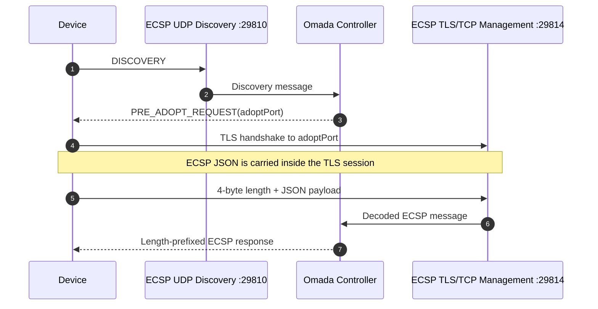
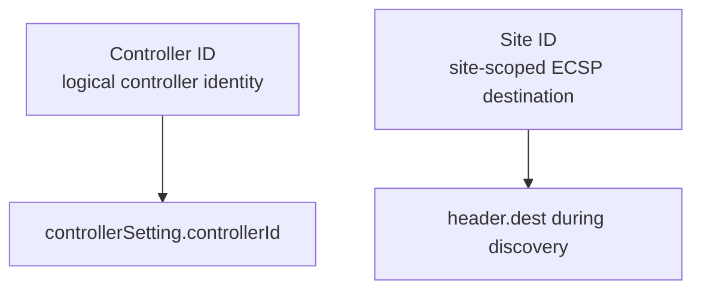
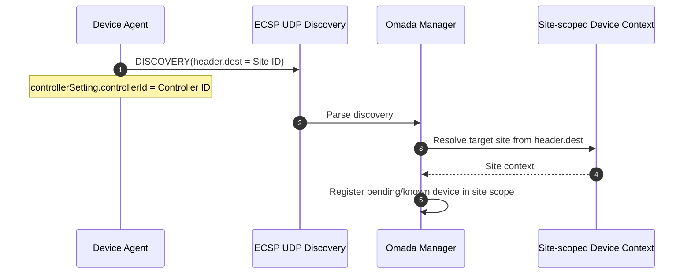
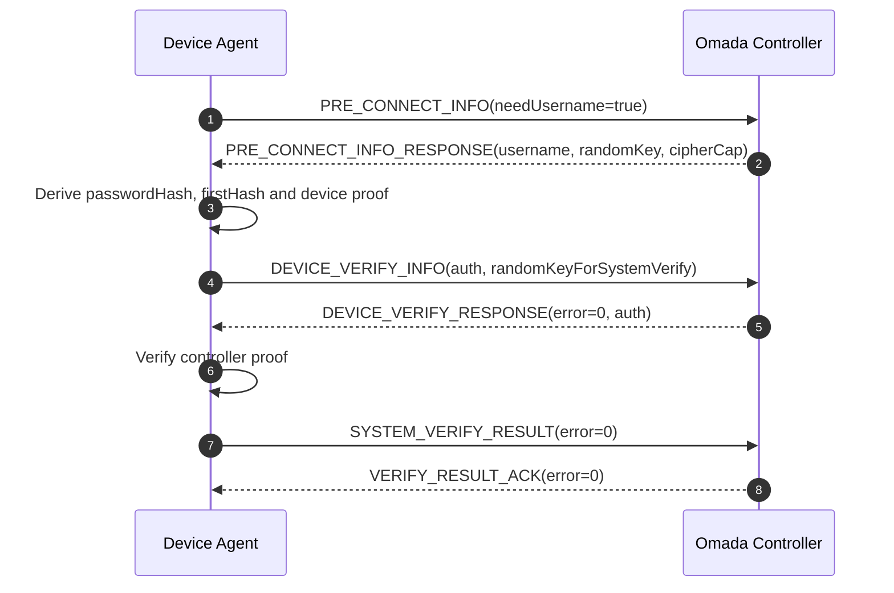
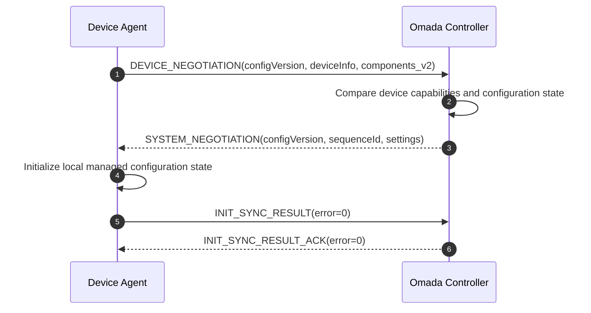

# Omada ECSP Protocol Overview

## Purpose

ECSP is the device-management protocol used between Omada-managed network
devices and an Omada controller. The protocol carries discovery, adoption,
authentication, configuration synchronization, periodic telemetry, commands,
and device notifications.

Open Omada Device Agent implements the **device side** of the subset documented
here.

## Transport model

The observed lifecycle uses UDP for discovery and a TLS-protected TCP session
for management. The sequence below shows the transport handoff rather than the
full adoption handshake.



Port numbers are controller-configurable and should be treated as defaults, not
protocol constants.

## ECSP message envelope

Each message contains a `header` object and, when applicable, a `body` object.
A representative device-to-controller message looks like:

```json
{
  "header": {
    "seq": 1,
    "version": "2.3.0",
    "verCap": 2,
    "device": "ap",
    "mac": "02:00:00:00:00:01",
    "type": 1,
    "error": 0,
    "dest": "0123456789abcdef01234567",
    "timestamp": 1780000000000
  },
  "body": {}
}
```

Important header fields:

| Field | Meaning |
| --- | --- |
| `seq` | Device/message sequence used for correlation in several request/response flows |
| `version` | ECSP protocol version string |
| `verCap` | Bit-capability field for ECSP protocol versions |
| `device` | Device family, for example `ap` |
| `mac` | Device MAC address |
| `type` | Numeric ECSP message type |
| `error` | Message-level result/error code |
| `dest` | Controller- or site-scoped destination identifier |
| `timestamp` | Millisecond timestamp when supplied by the sender |

## Message families currently modeled

| Message | Decimal | Hex | Direction in current flow |
| --- | ---: | ---: | --- |
| `DISCOVERY` | 1 | `0x000001` | Device → Controller |
| `PRE_ADOPT_REQUEST` | 2 | `0x000002` | Controller → Device |
| `PRE_CONNECT_INFO` | 3 | `0x000003` | Device → Controller |
| `INFORM_REQUEST` | 256 | `0x000100` | Device → Controller |
| `INFORM_RESPONSE` | 512 | `0x000200` | Controller → Device |
| `SET_REQUEST` | 4096 | `0x001000` | Controller → Device |
| `SET_RESPONSE` | 8192 | `0x002000` | Device → Controller |
| `GET_REQUEST` | 24576 | `0x006000` | Controller → Device |
| `GET_RESPONSE` | 28672 | `0x007000` | Device → Controller |
| `PRE_CONNECT_INFO_RESPONSE` | 1048576 | `0x100000` | Controller → Device |
| `DEVICE_VERIFY_INFO` | 1048577 | `0x100001` | Device → Controller |
| `DEVICE_VERIFY_RESPONSE` | 1048578 | `0x100002` | Controller → Device |
| `SYSTEM_VERIFY_RESULT` | 1048579 | `0x100003` | Device → Controller |
| `DEVICE_NEGOTIATION` | 1048580 | `0x100004` | Device → Controller |
| `SYSTEM_NEGOTIATION` | 1048581 | `0x100005` | Controller → Device |
| `INIT_SYNC_RESULT` | 1048582 | `0x100006` | Device → Controller |
| `VERIFY_RESULT_ACK` | 1048585 | `0x100009` | Controller → Device |
| `INIT_SYNC_RESULT_ACK` | 1048586 | `0x10000A` | Controller → Device |
| `REPORT` | 1376256 | `0x150000` | Device → Controller |

The enum in `ecsp.py` includes additional known identifiers, but implementation
status is tracked separately in [protocol-status.md](protocol-status.md).

## Site-scoped discovery

A key behavior in the tested Controller 6.2 family is the distinction between a
logical controller identifier and a site-scoped destination identifier.

The current agent keeps these concepts separate:



This matters because a device discovered without the proper site-scoped
destination can remain in a pending scope that is not surfaced like a normal
site device.

The resulting discovery exchange is:



## Authentication

The current implementation supports the validated legacy V2 `cipherType=5`
branch. It derives an uppercase MD5 representation of the password and then
uses SHA-256 for the request and response proofs.

Conceptually:

```text
password_hash = UPPERHEX(MD5(password))
first_hash    = UPPERHEX(SHA256(username + password_hash))
auth          = UPPERHEX(SHA256(first_hash + random_key))
```

The handshake is mutual: the device proves knowledge of the configured Device
Account credential and validates the controller-side proof before reporting
successful system verification.



This legacy branch is preserved for interoperability research. It is not a
recommendation to use MD5 for new authentication protocol design.

## Capability negotiation

After verification, the device advertises component versions in
`DEVICE_NEGOTIATION`. The controller returns its configuration and component
view in `SYSTEM_NEGOTIATION`.



Open Omada intentionally advertises a small component set. Claiming a component
without implementing its command/inform semantics can cause the controller to
provision state the agent cannot correctly apply.

## Lifecycle documentation

For the complete first-adoption, managed reconnect, rediscovery, configuration,
and runtime sequences, see [Device lifecycle](device-lifecycle.md).
