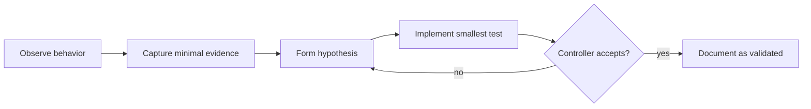

# Research Methodology

Open Omada is an interoperability project. Protocol documentation should be
reproducible and should not depend on distributing proprietary vendor code.

## Evidence levels

Use these labels in issues and protocol notes:

| Label | Meaning |
| --- | --- |
| **Observed** | Directly present in a packet capture, controller log, or device output |
| **Validated** | Reproduced by an independent implementation in a controlled lab |
| **Inferred** | Strongly suggested by behavior, but not yet independently proven |
| **Unknown** | Field or state exists but semantics are unresolved |

## Preferred workflow



Good evidence includes sanitized:

- ECSP message envelopes;
- packet timing and transport direction;
- controller state transitions;
- error codes and message types;
- minimal reproducible test scripts.

## Clean-room boundary

Do not commit:

- decompiled vendor source files;
- firmware images;
- vendor certificates or private keys;
- proprietary web assets;
- copied implementation bodies from non-public vendor code.

It is acceptable for documentation to describe independently discovered wire
behavior, field names required for interoperability, numeric message IDs, and
behavioral observations.

## Sanitization

Before attaching captures or logs to an issue, remove or replace:

- public/private IP addresses when they identify a deployment;
- controller/site identifiers;
- usernames;
- passwords and password-derived secrets;
- cookies, bearer tokens, session IDs, and API tokens;
- device serial numbers when sensitive;
- unrelated client MAC addresses and user traffic.

Prefer synthetic examples such as:

```text
controller.example.net
02:00:00:00:00:01
0123456789abcdef0123456789abcdef
0123456789abcdef01234567
```
